# Keycloak dataflow sample
This is a simple configuration example for making dataflow and skipper
to use `keycloak`.

NOTE: Keycloak configuration and use cases are quite opinionated
      meaning this sample should not be taken as is as it's a config
      which works end to end with minimal settings.

## Start and Configure Keycloak
Using embedded db.
```
docker run --name keycloak-dataflow -d -p 8844:8080 -e DB_VENDOR=h2 -e KEYCLOAK_USER=keycloakadmin -e KEYCLOAK_PASSWORD=password jboss/keycloak
```

Login `http://localhost:8844` with `keycloakadmin` and `password`.

## Create `dataflow` Realm
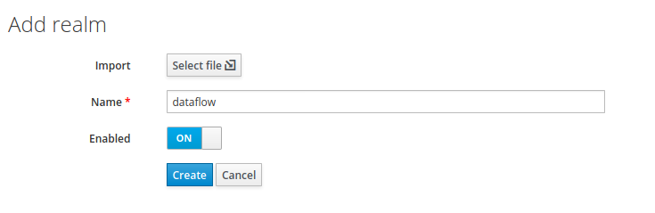

## Create `dataflow` Client
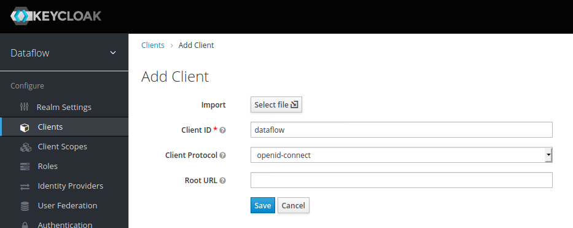

## Configure Client
Use _Access Type_ `confidential` and enable _Service Accounts Enabled_
and _Authorization Enabled_. Set _Valid Redirect URIs_
to`http://localhost:9393/*`

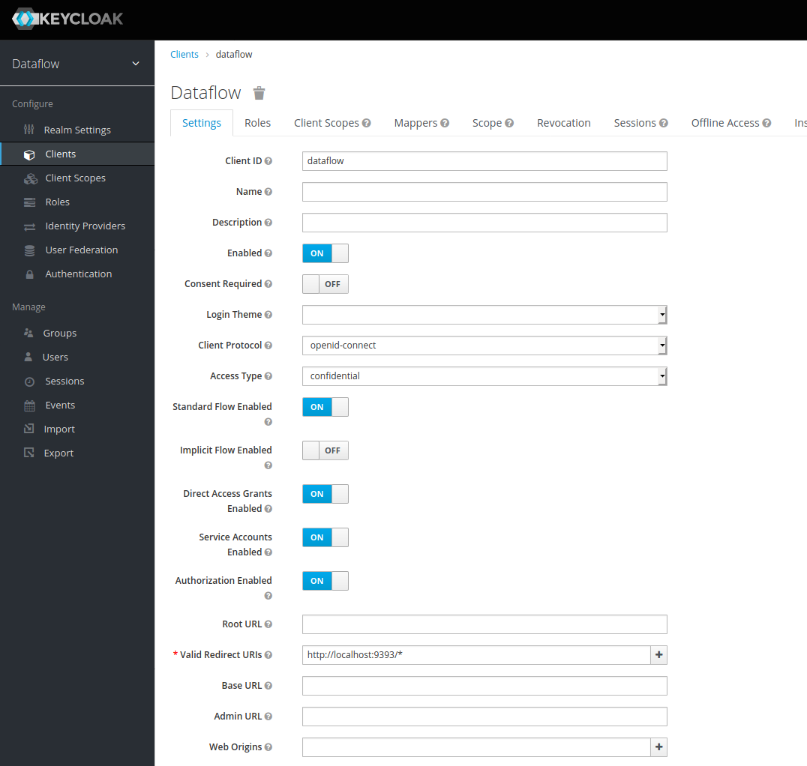

## Create Role
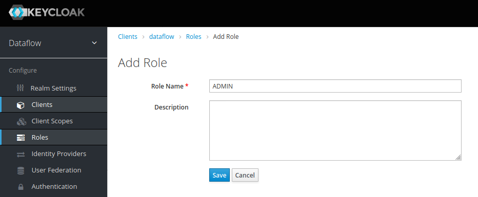

## Create Mapper
To map expected `user_name` create new mapper with _Name_ `Username`, _Mapper Type_ `User Property`, _Property_ `username`, _Token Claim Name_ `user_name` and _Claim JSON Type_ `String`.

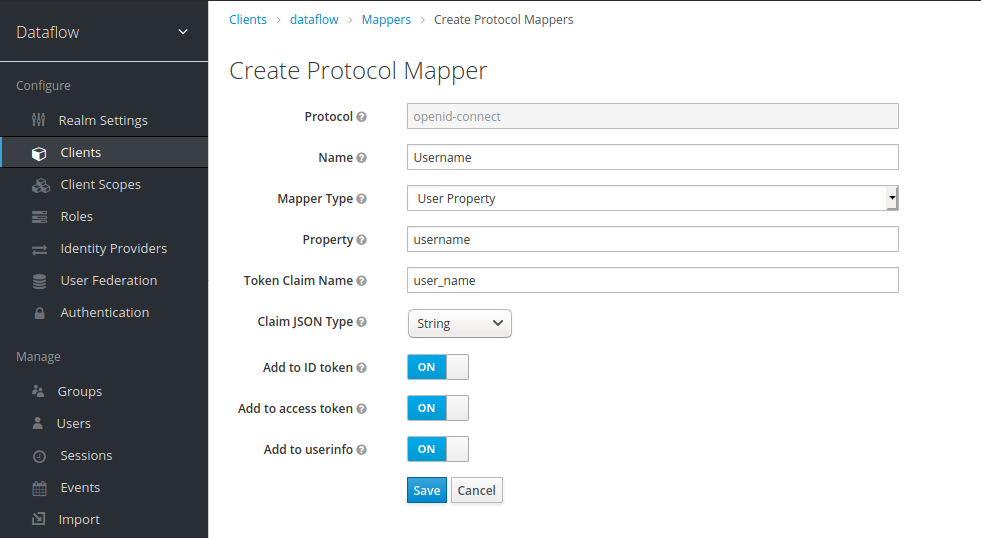

## Create User
Create user `admin`,

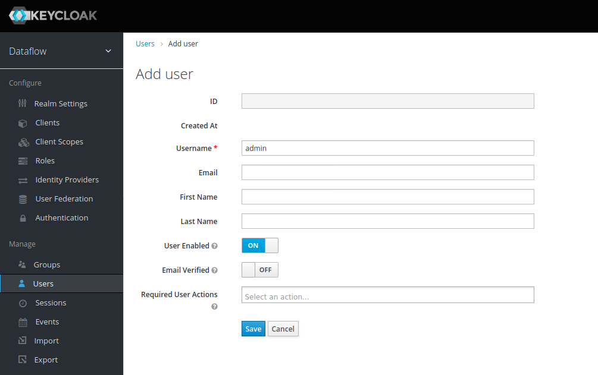

and set its password to `password` and disable requirement to change
it by setting _Temporary_ to `OFF`.

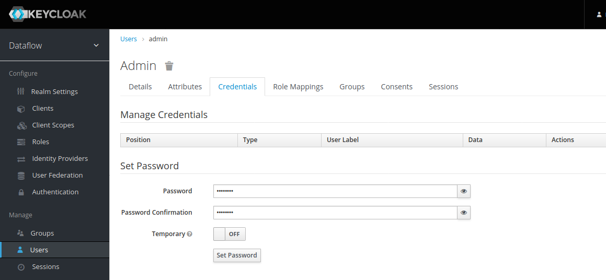

## Create Scopes
Create scopes `dataflow.view`.

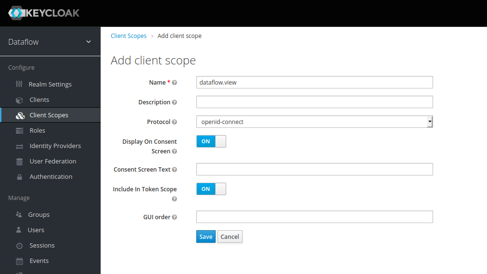

Repeat this with `dataflow.create`, `dataflow.manage`,
`dataflow.deploy`, `dataflow.destroy`, `dataflow.modify` and `dataflow.schedule`.

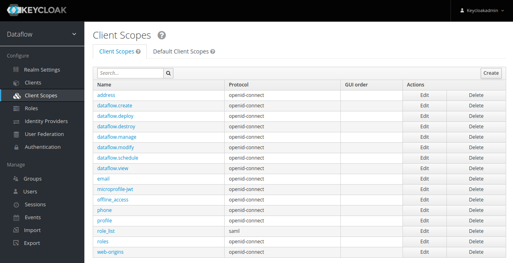

## Map Role to User
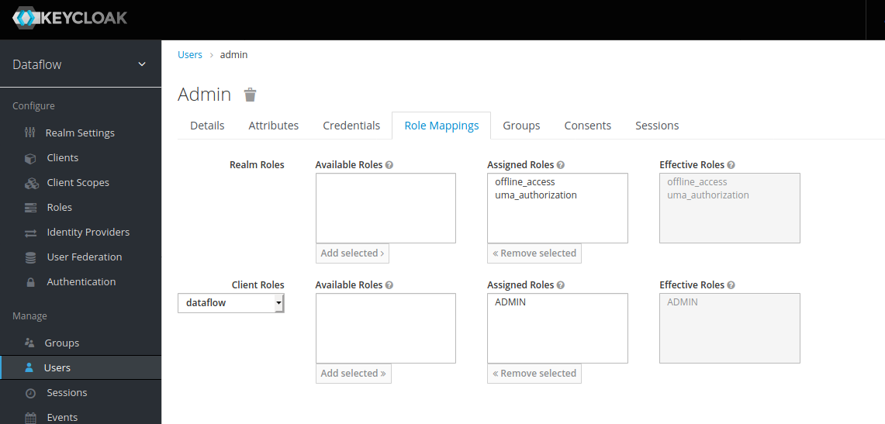

## Assign Scopes to Client
Assign all scopes as _Optional Client Scopes_.

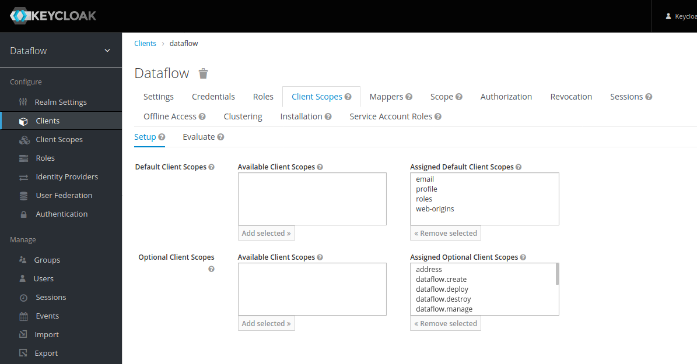

## Get Client Secret
Copy secret to be placed into dataflow/skipper configs.

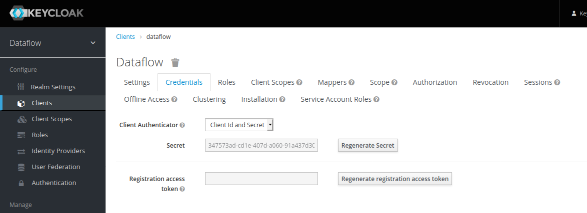

## Modify Servers Configs
In _dataflow-keycloak.yml_ and _skipper-keycloak.yml_
modify _client-secret_ with value `347573ad-cd1e-407d-a060-91a437d30e30`

Keycloak will also give known other settings directly from
`http://localhost:8844/auth/realms/dataflow/.well-known/openid-configuration` which are reflected to _yml_ files.

## Start Servers
Skipper:
```
java -jar spring-cloud-skipper-server-2.3.0.BUILD-SNAPSHOT.jar --spring.config.additional-location=skipper-keycloak.yml
```
Dataflow:
```
java -jar spring-cloud-dataflow-server-2.4.0.BUILD-SNAPSHOT.jar --spring.config.additional-location=dataflow-keycloak.yml
```

You can now go to `http://localhost:9393/dashboard`

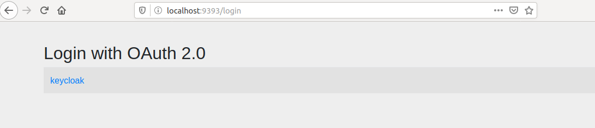

Login with `admin` and `password`

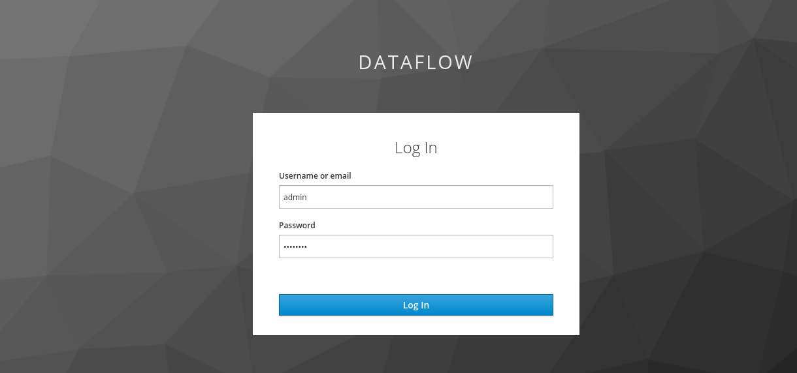

And you've logged in as admin rights and can start playing with it.

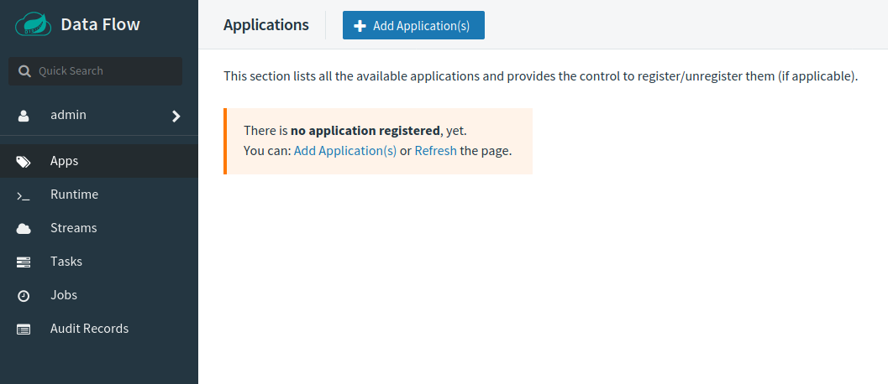
